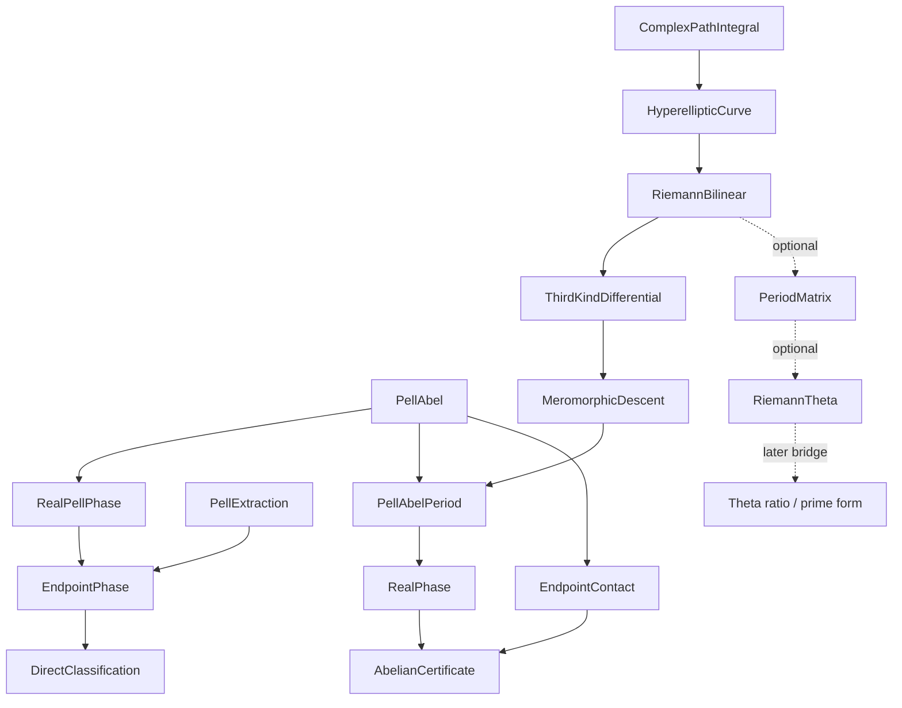

# Blueprint for `JoseSmoothest/SpecialFunctions.lean`

## Purpose and mathematical boundary

This is the future umbrella module for the reusable special-function library
needed to describe sharp kernels for arbitrary even difference order.  Write
the order as `2 * m`.  After the Fourier and kernel-polynomial reductions, the
problem is to minimize

```text
max_{-1 ≤ x ≤ 1} (1 - x)^m p(x)
```

over nonnegative polynomials `p` of the prescribed degree with `p(1)=1`.
If `Z` is the normalized equioscillating polynomial, then

```text
(1 - x)^m p(x) = scale * (1 - Z(x)).
```

Consequently `Z-1` has a zero of order `m` at `1`.  This contact forces every
squarefree Pell--Abel curve to have genus at least

```text
g = (m - 1) / 2
```

where the division is natural-number division.  Equivalently,
`g = floor ((m - 1) / 2)`.  This gives the hierarchy

| difference order | half-order `m` | minimal genus |
|---:|---:|---:|
| 2 | 1 | 0 |
| 4 | 2 | 0 |
| 6 | 3 | 1 |
| 8 | 4 | 1 |
| 10 | 5 | 2 |
| 12 | 6 | 2 |

Equality is the minimal-genus stratum.  Bogatyrev's extremality formula shows
that equality holds when every other critical point is simple and has value
`±1`, exactly the exhaustion supplied by the minimizer's alternation.  Extra
exceptional critical points can raise the genus.  A singular collision can
leave the squarefree `Curve` API, but exact `m`-fold contact cannot degenerate
to a lower-genus squarefree solution.

The logical dependency is deliberately split in two.

1. The unconditional even-order minimax theorem should be proved by compact
   finite-dimensional optimization, alternation, and polynomial algebra.  It
   can then *extract* a Pell--Abel curve from the minimizer.
2. The library below classifies that minimizer and makes it explicit through
   a normalized differential of the third kind.  Its period theorem is the
   special-function bridge.  General Riemann theta is useful for effective
   formulas, but is not a prerequisite for existence of the sharp kernel.

This distinction prevents the main theorem from waiting for a complete
formal theory of compact Riemann surfaces.

This directory is the **special-function workstream** inside the now complete
arbitrary-even blueprint.  The complementary constrained-minimax,
alternation, curve-extraction, and final kernel modules are specified in
`TwoSetAlternation.md`, `EvenOrder/WeightedMinimax.md`,
`EvenOrder/Equioscillation.md`, `EvenOrder/CurveExtraction.md`,
`EvenOrder/PellExtraction.md`, `EvenOrder.md`, and
`EvenOrder/Classification.md`.

## Blueprint/formalization correspondence

Every row is one planned Markdown/Lean pair.  The Markdown file contains the
complete intended public surface and the proof plan for that Lean module.

| Blueprint | Future Lean file | Role |
|---|---|---|
| `SpecialFunctions/ComplexPathIntegral.md` | `SpecialFunctions/ComplexPathIntegral.lean` | Thin adapters around Mathlib's curve-integral and path APIs |
| `SpecialFunctions/PellAbel.md` | `SpecialFunctions/PellAbel.lean` | Pure polynomial Pell--Abel algebra and endpoint valuations |
| `SpecialFunctions/RealPellPhase.md` | `SpecialFunctions/RealPellPhase.lean` | Direct real phase and cosine classification for a supplied Pell solution |
| `SpecialFunctions/HyperellipticCurve.md` | `SpecialFunctions/HyperellipticCurve.lean` | Specialized even-degree hyperelliptic cut model |
| `SpecialFunctions/RiemannBilinear.md` | `SpecialFunctions/RiemannBilinear.lean` | Core polygonal energy/period nondegeneracy theorem |
| `SpecialFunctions/ThirdKindDifferential.md` | `SpecialFunctions/ThirdKindDifferential.lean` | Distinguished normalized differential and periods |
| `SpecialFunctions/MeromorphicDescent.md` | `SpecialFunctions/MeromorphicDescent.lean` | Core compact-curve unit and polynomial descent layer |
| `SpecialFunctions/PellAbelPeriod.md` | `SpecialFunctions/PellAbelPeriod.lean` | Period/torsion criterion and polynomial recovery |
| `SpecialFunctions/RealPhase.md` | `SpecialFunctions/RealPhase.lean` | Reality, monotone phase, bounds, and equioscillation |
| `SpecialFunctions/PeriodMatrix.md` | `SpecialFunctions/PeriodMatrix.lean` | Optional normalized periods and Siegel upper half-space |
| `SpecialFunctions/RiemannTheta.md` | `SpecialFunctions/RiemannTheta.lean` | Optional foundational genus-`g` theta series |
| `SpecialFunctions.md` | `SpecialFunctions.lean` | Umbrella import only |
| `EvenOrder/EndpointContact.md` | `EvenOrder/EndpointContact.lean` | Project adapter computing the genus and differential numerator |
| `EvenOrder/AbelianCertificate.md` | `EvenOrder/AbelianCertificate.lean` | Converts analytic data into the generic even-order certificate |

The complete theorem-side continuation adds these pairs:

| Blueprint | Future Lean file | Role |
|---|---|---|
| `TwoSetAlternation.md` | `TwoSetAlternation.lean` | Alternating finite subsets or a strict polynomial separator |
| `EvenOrder/WeightedMinimax.md` | `EvenOrder/WeightedMinimax.lean` | Generic norm and sufficient certificate theorem |
| `EvenOrder/FourierReduction.md` | `EvenOrder/FourierReduction.lean` | Exact generic kernel-to-weighted-norm identity |
| `EvenOrder/ActiveSetPerturbation.md` | `EvenOrder/ActiveSetPerturbation.lean` | Strict active-set separator gives a better feasible polynomial |
| `EvenOrder/Equioscillation.md` | `EvenOrder/Equioscillation.lean` | Compact minimizer and necessary zero--peak alternation |
| `EvenOrder/EndpointAlternation.md` | `EvenOrder/EndpointAlternation.lean` | Critical-point exhaustion and endpoint-inclusive alternation |
| `EvenOrder/PellExtraction.md` | `EvenOrder/PellExtraction.lean` | Algebraic minimal-genus Pell factor extracted from alternation |
| `EvenOrder/EndpointPhase.md` | `EvenOrder/EndpointPhase.lean` | Endpoint integrability and exact winding of the extracted solution |
| `EvenOrder/DirectClassification.md` | `EvenOrder/DirectClassification.lean` | Unconditional direct classification and endpoint constant |
| `EvenOrder/CurveExtraction.md` | `EvenOrder/CurveExtraction.lean` | Explicit minimal-genus Pell curve extracted from the minimizer |
| `EvenOrder.md` | `EvenOrder.lean` | Unconditional sharp kernel theorem for every even order |
| `EvenOrder/Classification.md` | `EvenOrder/Classification.lean` | Optional Pell--Abel classification of that kernel |

The last two files live outside the reusable special-function namespace:
they know about the smoothing problem, while the preceding files do not.

## Mathlib audit at the pinned version

The project is pinned to Mathlib `v4.32.0`.  The following foundations are
already available and should be reused:

- polynomial roots, multiplicities, derivatives, squarefreeness, and degree;
- one-variable real and complex calculus and interval integration;
- curve integrals, path and homotopy infrastructure, Poincaré lemmas,
  exponential covering maps, and path/homotopy lifting;
- plane meromorphic functions and their local orders/divisors;
- generic complex-manifold definitions;
- integer-lattice summability and positive-definite matrices;
- genus-one `jacobiTheta₂`, its derivative, periodicity, parity, and
  functional equation;
- the genus-one Weierstrass `℘` function attached to a period pair.

The following **core** higher-genus infrastructure is not in Mathlib:

- hyperelliptic curves as compact analytic surfaces, their two infinities,
  involution, cycles, and real ovals;
- the specialized lifted cut cycles and integration of hyperelliptic
  differentials around them;
- normalized differentials of the third kind and their period vectors;
- meromorphic units on the cut model and invariant descent to polynomials.

The optional explicit-evaluation branch would additionally need:

- normalized period matrices and Siegel upper half-space;
- genus-`g` Riemann theta and characteristics;
- a specialized Abel-coordinate/prime-form or theta-ratio bridge.

General complex tori, Jacobians, Abel's theorem, and Jacobi inversion are also
absent from Mathlib, but the present plan does not require them.

## Forward-construction scope and practical roadmap

The completed direct classification changes what the analytic library must
do.  It is no longer needed to prove existence, sharpness, or uniqueness of
the optimizer.  Its job is to give a forward description of the already
unique Pell weight `D`.

There are three distinct targets.

1. A **supplied-curve period criterion** starts with a marked real
   hyperelliptic polynomial `D`, integrates the fixed endpoint differential
   `(x-1)^g dx/y`, and proves that the required integral periods are
   equivalent to a degree-`N` Pell solution.  This is the smallest reusable
   all-genus target.
2. A **finite real-period construction** parameterizes the allowed branch
   points and characterizes the smoothing curve by a square system of period,
   torsion, and phase-length equations.  The current minimizer proves this
   system is nonempty; uniqueness identifies any solution with the extracted
   `D`.  This yields a certified numerical recipe even without theta
   functions.
3. A **theta/prime-form formula** builds normalized period matrices, Abel
   maps, Riemann theta, prime forms, and polynomial descent.  This is an
   optional explicit-evaluation layer, not a prerequisite of the smoothing
   theorem.

The central identification argument should be reused at every genus.  Given
forward data satisfying

```text
P² - D Q² = 1,       P' = N (x-1)^g Q,
```

together with the endpoint contact, real sign, and phase-length conditions,
form the normalized endpoint quotient `(1-P)/(1-x)^m`.  The Pell bound and
phase winding give its nonnegativity and full alternation certificate.  The
already-proved weighted-minimizer uniqueness then identifies this quotient,
`P`, and `D` with the canonical objects.  Thus the forward library need not
repeat the variational proof.

The low-genus gates are deliberately concrete:

- `m=1,2` (genus zero): recover the quadratic Pell weights directly from the
  existing Chebyshev formulas;
- `m=3` (sixth derivative): identify any `CubicZolotarevData` with the
  canonical minimizer and derive `D=(X²-1)H` and `D'(1)=2r²`;
- `m=4` (eighth derivative): expose the genus-one quartic/cubic-core normal
  form and test the even-contact parity;
- begin genus two only after both genus-one parity cases pass.

A specialized unconditional sixth-order elliptic construction is expected
to be a focused multi-week project; a polished finite cut-basis period
library is a multi-person-month project.  A general theta/prime-form stack is
substantially larger and carries independent global-existence questions, so
it should remain the final optional stage.

The proposed cut-model route intentionally does **not** attempt all of the
last three bullets.  It proves only the period criterion and real-phase facts
needed for Pell--Abel extremizers.  `RiemannTheta` is an independent optional
leaf and can be upstreamed without first formalizing Jacobians.

## Implementation order and gates



1. `PellAbel` is implemented: it is pure algebra, has no analytic risk, and
   its endpoint-valuation lemmas are candidates for Mathlib.
2. Implement `WeightedMinimax`, the finite-set alternation dichotomy, and
   `Equioscillation`.  These yield the unconditional minimizer and intrinsic
   sharp constant without special functions; finish `EvenOrder` immediately
   after them.
3. Implement `EndpointContact`, then `PellExtraction`: endpoint valuations,
   critical-point exhaustion, and the explicit squarefree Pell factor.
4. `RealPellPhase`, its `EndpointPhase` specialization using the extracted
   endpoint factors and Mathlib's endpoint-weight integrability, and the
   unconditional `DirectClassification` are now implemented and checked.
5. Optionally, implement only the missing adapters from Mathlib's existing
   curve-integral/path APIs, then the specialized `HyperellipticCurve` cut
   model and its meromorphic
   chart layer, and the shared Riemann-bilinear energy theorem.
6. Construct and normalize the third-kind differential.  Do not proceed to
   polynomial recovery until all normalization signs and residues at the two
   infinities have executable low-genus tests.
7. Prove the Pell--Abel period criterion and specialize it to the curve-based
   real phase.
8. Connect the result through `AbelianCertificate` and `CurveExtraction`;
   finish `Classification`.
9. Only then decide whether explicit constants require `PeriodMatrix`,
   `RiemannTheta`, and a specialized theta-ratio bridge, or can
   be left as uniquely determined real period integrals.

The first major gate is genus one: the new generic statements must recover
the existing cubic `CubicZolotarevData` construction.  The second is eighth
order, which is still genus one but has even endpoint contact and therefore a
different squarefree Pell factor.  Genus two should not begin until both
low-genus parity cases pass.

## Sources controlling the blueprint

- A. B. Bogatyrev,
  [*Effective approach to least deviation problems*](https://www.mathnet.ru/php/getFT.phtml?jrnid=sm&paperid=698&what=fullteng):
  definition of `g`-extremality, the squarefree hyperelliptic curve,
  normalized third-kind differential, Abel period equations, and recovery by
  a cosine of an Abelian integral.
- A. Bogatyrev and Q. Gendron,
  [*The space of solvable Pell--Abel equations*](https://www.cambridge.org/core/services/aop-cambridge-core/content/view/6104CD101814B5CB6C9573F517913EC5/S0010437X25007158a.pdf/the-space-of-solvable-pell-abel-equations.pdf):
  the modern period criterion, torsion interpretation, and degree/genus
  bookkeeping.
- [The smoothing paper](https://arxiv.org/abs/2604.25074): the endpoint
  contact order, positivity, and precise
  real equioscillation constraints particular to the kernel problem.

The general existence theorem for a Pell--Abel curve of degree `N > g` does
not by itself solve our constrained problem: it does not impose the required
real branch topology, the full endpoint zero of the differential numerator,
or the prescribed alternation interval.  The blueprint therefore makes no
unsupported global analytic-existence claim.

## Imports

```lean
import JoseSmoothest.SpecialFunctions.ComplexPathIntegral
import JoseSmoothest.SpecialFunctions.PellAbel
import JoseSmoothest.SpecialFunctions.RealPellPhase
import JoseSmoothest.SpecialFunctions.HyperellipticCurve
import JoseSmoothest.SpecialFunctions.ThirdKindDifferential
import JoseSmoothest.SpecialFunctions.PellAbelPeriod
import JoseSmoothest.SpecialFunctions.RealPhase
```

`RiemannTheta` is intentionally not imported by the umbrella: clients that
want effective theta formulas import it explicitly.

## Public declarations

There are no declarations in this file.  Its imports expose the reusable
period-criterion library without forcing the optional theta dependency.
